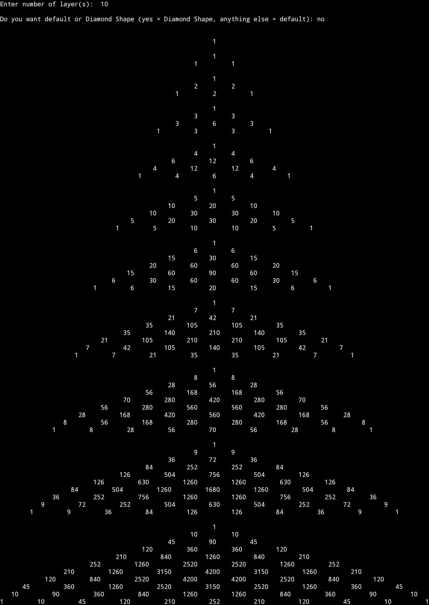
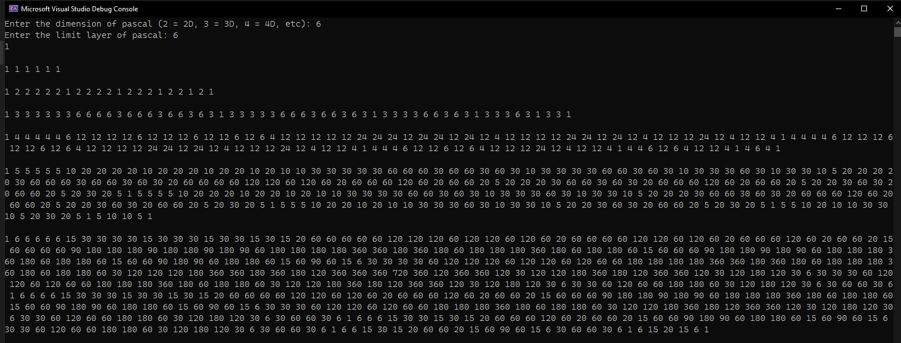

# pascal_generator
using this you can generate pascal triangle, pyramid, and for the forth dimension I will do it soon, the problem is visualizing the 4D but the formula is just simple: w!/(x!*(y-x)!*(z-y)!*(w-z)!)
# example of 3D generation:

# the use of pascal n-simplex generator:

well I dont find it a lot useful in daily life but like its definitely helpful like as example you can see in the image above, the layer 6 of a pascal 6D is a bunch of numbers, but not any random numbers summed up in a weird way(technically they are but like they have other uses too!) those numbers have a use in algebra for example (a+b+c+d+e+f)^6 is equal to

a6+6a5b+6a5c+6a5d+6a5f+6a5m+15a4b2+30a4bc+30a4bd+30a4bf+30a4bm+15a4c2+30a4cd+30a4cf+30a4cm+15a4d2+30a4df+30a4dm+15a4f2+30a4fm+15a4m2+20a3b3+60a3b2c+60a3b2d+60a3b2f+60a3b2m+60a3bc2+120a3bcd+120a3bcf+120a3bcm+60a3bd2+120a3bdf+120a3bdm+60a3bf2+120a3bfm+60a3bm2+20a3c3+60a3c2d+60a3c2f+60a3c2m+60a3cd2+120a3cdf+120a3cdm+60a3cf2+120a3cfm+60a3cm2+20a3d3+60a3d2f+60a3d2m+60a3df2+120a3dfm+60a3dm2+20a3f3+60a3f2m+60a3fm2+20a3m3+15a2b4+60a2b3c+60a2b3d+60a2b3f+60a2b3m+90a2b2c2+180a2b2cd+180a2b2cf+180a2b2cm+90a2b2d2+180a2b2df+180a2b2dm+90a2b2f2+180a2b2fm+90a2b2m2+60a2bc3+180a2bc2d+180a2bc2f+180a2bc2m+180a2bcd2+360a2bcdf+360a2bcdm+180a2bcf2+360a2bcfm+180a2bcm2+60a2bd3+180a2bd2f+180a2bd2m+180a2bdf2+360a2bdfm+180a2bdm2+60a2bf3+180a2bf2m+180a2bfm2+60a2bm3+15a2c4+60a2c3d+60a2c3f+60a2c3m+90a2c2d2+180a2c2df+180a2c2dm+90a2c2f2+180a2c2fm+90a2c2m2+60a2cd3+180a2cd2f+180a2cd2m+180a2cdf2+360a2cdfm+180a2cdm2+60a2cf3+180a2cf2m+180a2cfm2+60a2cm3+15a2d4+60a2d3f+60a2d3m+90a2d2f2+180a2d2fm+90a2d2m2+60a2df3+180a2df2m+180a2dfm2+60a2dm3+15a2f4+60a2f3m+90a2f2m2+60a2fm3+15a2m4+6ab5+30ab4c+30ab4d+30ab4f+30ab4m+60ab3c2+120ab3cd+120ab3cf+120ab3cm+60ab3d2+120ab3df+120ab3dm+60ab3f2+120ab3fm+60ab3m2+60ab2c3+180ab2c2d+180ab2c2f+180ab2c2m+180ab2cd2+360ab2cdf+360ab2cdm+180ab2cf2+360ab2cfm+180ab2cm2+60ab2d3+180ab2d2f+180ab2d2m+180ab2df2+360ab2dfm+180ab2dm2+60ab2f3+180ab2f2m+180ab2fm2+60ab2m3+30abc4+120abc3d+120abc3f+120abc3m+180abc2d2+360abc2df+360abc2dm+180abc2f2+360abc2fm+180abc2m2+120abcd3+360abcd2f+360abcd2m+360abcdf2+720abcdfm+360abcdm2+120abcf3+360abcf2m+360abcfm2+120abcm3+30abd4+120abd3f+120abd3m+180abd2f2+360abd2fm+180abd2m2+120abdf3+360abdf2m+360abdfm2+120abdm3+30abf4+120abf3m+180abf2m2+120abfm3+30abm4+6ac5+30ac4d+30ac4f+30ac4m+60ac3d2+120ac3df+120ac3dm+60ac3f2+120ac3fm+60ac3m2+60ac2d3+180ac2d2f+180ac2d2m+180ac2df2+360ac2dfm+180ac2dm2+60ac2f3+180ac2f2m+180ac2fm2+60ac2m3+30acd4+120acd3f+120acd3m+180acd2f2+360acd2fm+180acd2m2+120acdf3+360acdf2m+360acdfm2+120acdm3+30acf4+120acf3m+180acf2m2+120acfm3+30acm4+6ad5+30ad4f+30ad4m+60ad3f2+120ad3fm+60ad3m2+60ad2f3+180ad2f2m+180ad2fm2+60ad2m3+30adf4+120adf3m+180adf2m2+120adfm3+30adm4+6af5+30af4m+60af3m2+60af2m3+30afm4+6am5+b6+6b5c+6b5d+6b5f+6b5m+15b4c2+30b4cd+30b4cf+30b4cm+15b4d2+30b4df+30b4dm+15b4f2+30b4fm+15b4m2+20b3c3+60b3c2d+60b3c2f+60b3c2m+60b3cd2+120b3cdf+120b3cdm+60b3cf2+120b3cfm+60b3cm2+20b3d3+60b3d2f+60b3d2m+60b3df2+120b3dfm+60b3dm2+20b3f3+60b3f2m+60b3fm2+20b3m3+15b2c4+60b2c3d+60b2c3f+60b2c3m+90b2c2d2+180b2c2df+180b2c2dm+90b2c2f2+180b2c2fm+90b2c2m2+60b2cd3+180b2cd2f+180b2cd2m+180b2cdf2+360b2cdfm+180b2cdm2+60b2cf3+180b2cf2m+180b2cfm2+60b2cm3+15b2d4+60b2d3f+60b2d3m+90b2d2f2+180b2d2fm+90b2d2m2+60b2df3+180b2df2m+180b2dfm2+60b2dm3+15b2f4+60b2f3m+90b2f2m2+60b2fm3+15b2m4+6bc5+30bc4d+30bc4f+30bc4m+60bc3d2+120bc3df+120bc3dm+60bc3f2+120bc3fm+60bc3m2+60bc2d3+180bc2d2f+180bc2d2m+180bc2df2+360bc2dfm+180bc2dm2+60bc2f3+180bc2f2m+180bc2fm2+60bc2m3+30bcd4+120bcd3f+120bcd3m+180bcd2f2+360bcd2fm+180bcd2m2+120bcdf3+360bcdf2m+360bcdfm2+120bcdm3+30bcf4+120bcf3m+180bcf2m2+120bcfm3+30bcm4+6bd5+30bd4f+30bd4m+60bd3f2+120bd3fm+60bd3m2+60bd2f3+180bd2f2m+180bd2fm2+60bd2m3+30bdf4+120bdf3m+180bdf2m2+120bdfm3+30bdm4+6bf5+30bf4m+60bf3m2+60bf2m3+30bfm4+6bm5+c6+6c5d+6c5f+6c5m+15c4d2+30c4df+30c4dm+15c4f2+30c4fm+15c4m2+20c3d3+60c3d2f+60c3d2m+60c3df2+120c3dfm+60c3dm2+20c3f3+60c3f2m+60c3fm2+20c3m3+15c2d4+60c2d3f+60c2d3m+90c2d2f2+180c2d2fm+90c2d2m2+60c2df3+180c2df2m+180c2dfm2+60c2dm3+15c2f4+60c2f3m+90c2f2m2+60c2fm3+15c2m4+6cd5+30cd4f+30cd4m+60cd3f2+120cd3fm+60cd3m2+60cd2f3+180cd2f2m+180cd2fm2+60cd2m3+30cdf4+120cdf3m+180cdf2m2+120cdfm3+30cdm4+6cf5+30cf4m+60cf3m2+60cf2m3+30cfm4+6cm5+d6+6d5f+6d5m+15d4f2+30d4fm+15d4m2+20d3f3+60d3f2m+60d3fm2+20d3m3+15d2f4+60d2f3m+90d2f2m2+60d2fm3+15d2m4+6df5+30df4m+60df3m2+60df2m3+30dfm4+6dm5+f6+6f5m+15f4m2+20f3m3+15f2m4+6fm5+m6

this monstrosity has the same numbers as the pascal 6D's 6th layer, the other use of it is umm explained by wikipedia idk how to explain it
https://en.wikipedia.org/wiki/Pascal%27s_pyramid#Trinomial_distribution_connection
and umm wikipedia in total explains good amount of uses of pascal: https://en.wikipedia.org/wiki/Pascal%27s_triangle

the reason why I made this was not related to school(umm a lil bit related but not really tbh), I was just bored -_-
